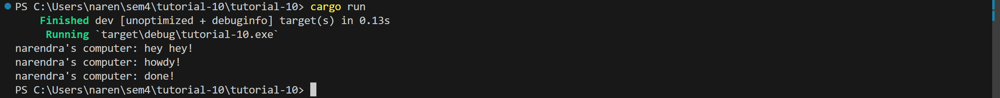
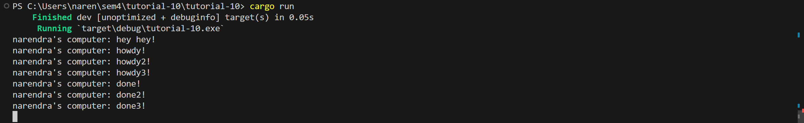
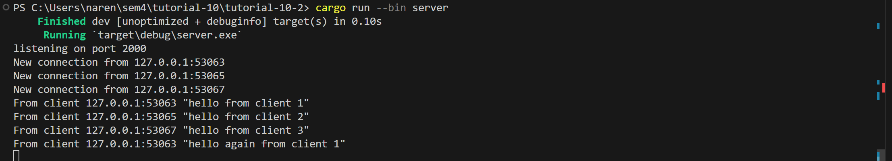
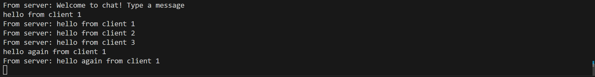
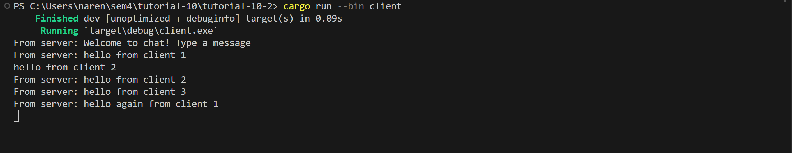
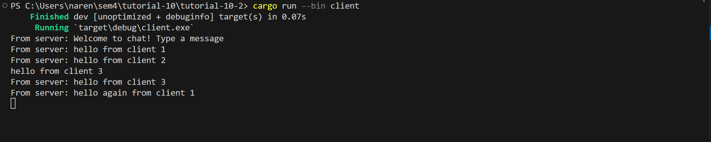

# tutorial-10

## Refleksi
### Experiment 1.2

Perintah print setelah `spawner.spawn` muncul lebih dulu dibandingkan yang ada pada `spawner.spawn`. Hal ini terjadi karena `spawner.spawn` hanya menjadwalkan task untuk dieksekusi oleh executor. Task yang dijadwalkan baru dieksekusi setelah perintah `executor.run() `
### Experiment 1.3

Seluruh output howdy muncul lebih dulu dan setelah 2 detik, seluruh output done muncul. Namun, setelah semua task dieksekusi, program tidak berhenti. Hal ini terjadi karena tanpa printah `drop(spawner)`, program akan terus menunggu task yang akan datang untuk dieksekusi. Ketika dijalankan perintah `drop(spawner)`, executor tahu bahwa tidak ada lagi task yang akan datang, sehingga program dapat berhenti.

### Experiment 2.1
Menjalankan server dilakukan dengan perintah `cargo run --bin server` dan `cargo run --bin client` untuk menjalankan client.

Ketika client dijalankan, maka server akan menerima connection yang ditampilkan pada console.

Jika kita mengirimkan text melalui client, server akan mengembalikan pesan tersebut kepada seluruh client. Server juga menampilkan pesan yang diterima dari client. Berikut adalah tampilan pada client 2 dan 3.

### Experiment 2.2
Selain port pada client, port listener yang ada di server juga perlu diubah. Listener berada pada main function dari `client.rs`, pada baris kode `let listener = TcpListener::bind("127.0.0.1:8080").await?;`